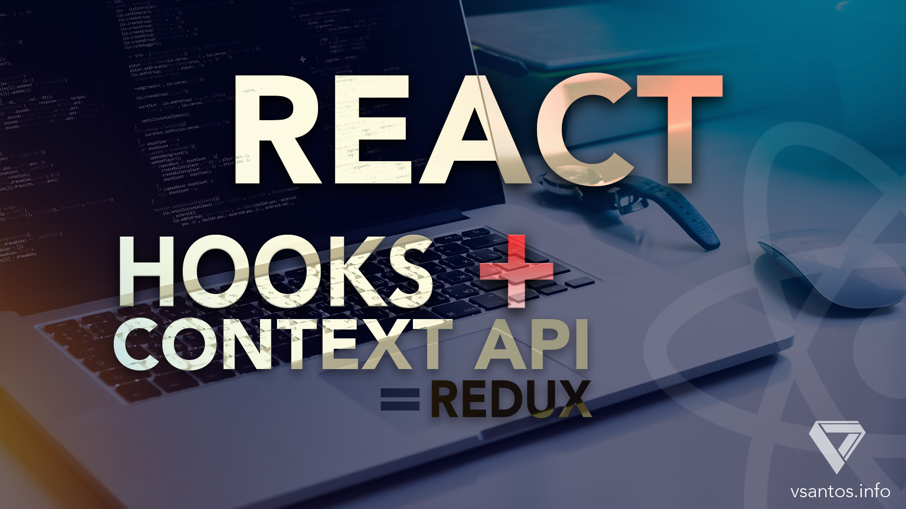

# Webpack Configuration

[](https://david-dm.org/victors1681/webpack-boilerplate)

> This repo is the result of my tutorial about how to create a React app and using the concept of redux using context api + hooks (useReduce).




## Requirements

[nodejs](https://nodejs.org/en/)

## Download

Copy this project without git from terminal.

```
curl -L -o master.zip https://github.com/victors1681/contextapi-hooks-tutorial/archive/master.zip && unzip master.zip && rm master.zip

```

## Installing

```
npm install
```

## Development

Run the local webpack-dev-server on http://localhost:9000/

```
npm run start
```

## Deployment

Build the current application

```
npm run dist
```
